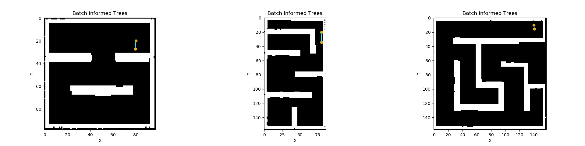
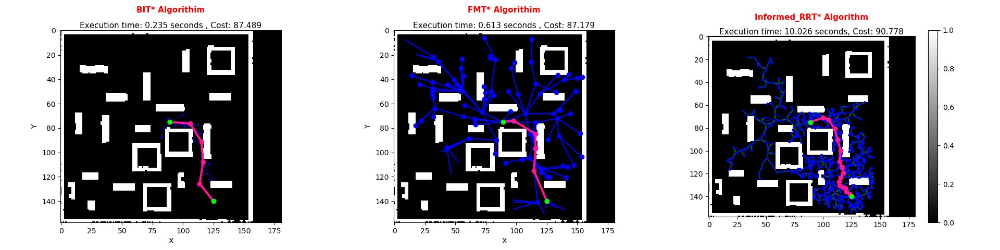
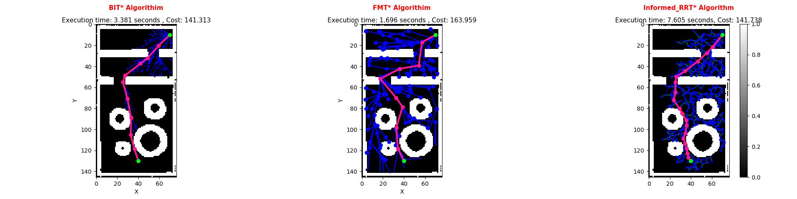
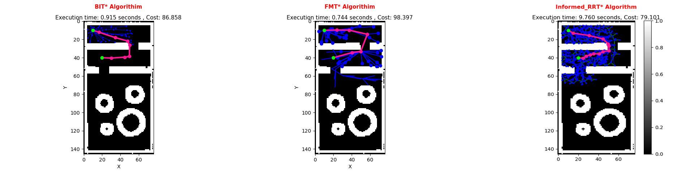

## Fast Marching Trees(FMT)

Parameters:

- Research radius : The formula mathsqrt((math.log(n)˙ / n)) is a way to achieve this shrinking radius, where the math.log(n) / n term goes to zero as n (nu.of.samples) grows large, effectively reducing the radius.
- Number of samples

## Batch Informed Trees(BIT)

The algorithm can be summarized as follows:

- Divide the search space into a number of overlapping regions.
- Initialize a tree in each region with the start node.
- Expand all trees in parallel until the goal is reached.
- Find the cheapest path to the goal from all trees and connect them. Repeat steps 3 and 4 until convergence.

## Comparative Analysis (FMT,BIT,Informed RRTstar)

- The three motion planning algorithms, Informed RRT*, FMT, and BIT, have distinct characteristics related to optimality and speed.
- Informed RRT* aims to achieve global optimality in motion planning tasks.
- FMT prioritizes speed and efficiency, making it efficient for large-scale problems.
- BIT strikes a balance between optimality and speed by combining features from Informed RRT* and FMT.
- Informed RRT* is known for its extreme optimality.
- FMT excels in speed, offering fast exploration of the search space.
- BIT provides a compromise between optimality and speed.
- Informed RRT* achieves high optimality, FMT prioritizes speed, and BIT offers a desirable compromise for motion planning tasks.

