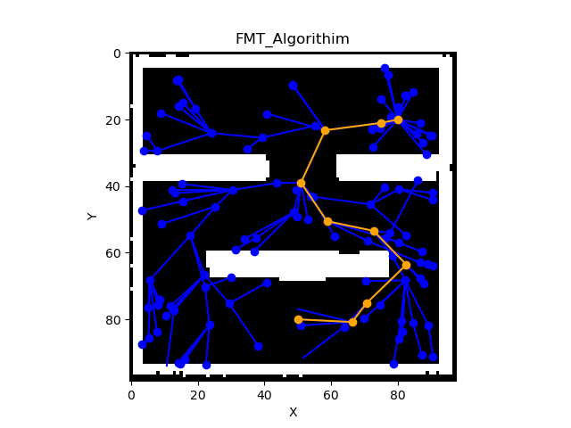
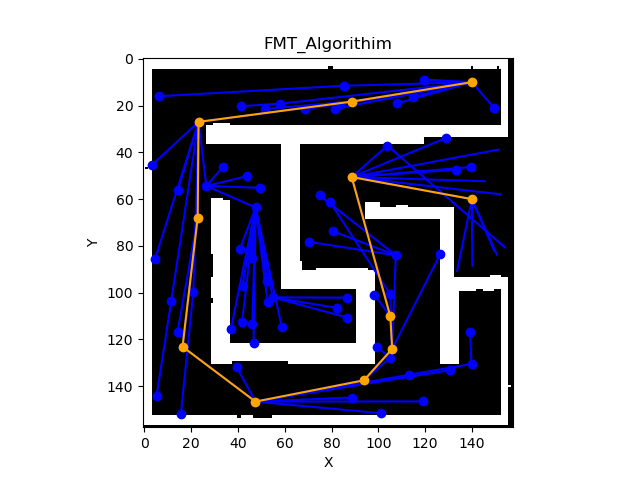
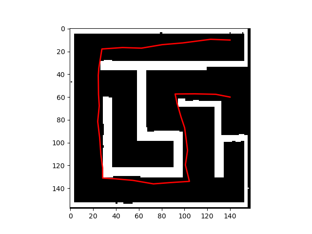
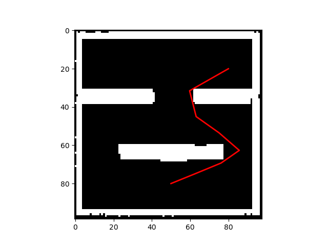

## Fast Marching Trees(FMT)

Parameters:

- Research radius : The formula mathsqrt((math.log(n)˙ / n)) is a way to achieve this shrinking radius, where the math.log(n) / n term goes to zero as n (nu.of.samples) grows large, effectively reducing the radius.
- Number of samples

Algorithm Breakdown
Step (1):Initialization 
- Initializes the algorithm and sets up the starting point, z, as the initial point. It also calculates the radius within which the algorithm will look for nearby nodes,and initializes an empty list to keep track of the visited nodes.

- In each iteration of the loop, the algorithm identifies a set of nearby points, X~~ near, and adds the current point, z, to the visited list.

Step (2): Finding minimum cost path: 

- finds the minimum-cost path from the current point, z, to each nearby point in X~~ near. It does this by finding the nearest point in the V~~ open set and calculating the cost of moving from that point to x, and then selecting the minimum cost path. If the path does not collide with obstacles, the code adds x to the V~~ open~~ new set, removes it from the V~~ unvisited set, updates its cost and parent nodes, and adds the edge connecting x to its parent to the visited edges list.

- updates the open and closed sets, removes the current point, z, from the V~~ open set, and adds it to the V~~ closed set. adds the current point to the visited nodes set. If the V~~ open set becomes empty, the algorithm terminates. Otherwise, it selects the point in V~~ open with the lowest cost as the new current point, z.

Figure 1: FMT results of map0 and map1

## Batch Informed Trees(BIT)

Algorithm Breakdown

Batch Informed Trees (BIT\*) is an extension of the Informed RRT\* algorithm. Like Informed RRT\*, it constructs a tree of paths from the start to the goal, but instead of growing the tree incrementally, it performs a batch of expansions at each iteration It divide the search space into a number of overlapping regions and using a separate tree to explore each region. At each iteration, it selects the best tree and expands it by adding a new node to the tree. The goal is to find the optimal path to the goal by iteratively refining the search space.

BIT\* uses a number of heuristics to guide its search, including the distance to the goal, the cost of the path so far, and the cost of the best path found so far. It also uses a technique called lazy collision checking, which avoids costly collision checks until it is absolutely necessary.

The algorithm can be summarized as follows:

- Divide the search space into a number of overlapping regions.
- Initialize a tree in each region with the start node.
- Expand all trees in parallel until the goal is reached.
- Find the cheapest path to the goal from all trees and connect them. Repeat steps 3 and 4 until convergence.

